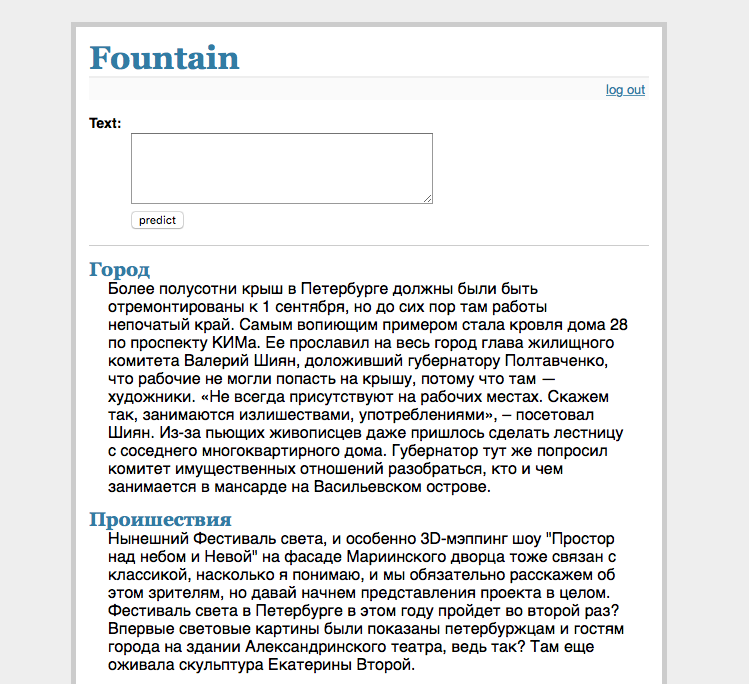

# Web view for Exercise 5. Prediction of news categories.
To run this You need to write in terminal: 
1. export FLASK_APP=flaskr 
2. flask initdb 
3. flask run 
   Then you can proceed to http://localhost:5000/ 
4. Enter **login: admin**, **password: default** 

### Additional data
You need to download [texts](https://yadi.sk/d/92TbmE7cy5Lds) and put it in `data\` folder. This is due to the reason that github does not allow to load files larger than 100mb.  

And it's pretty heavy, so be patient. Will fix it one day. *(sorry for now c:)* 

But in the end, you should get something like this: 

Thanks to flask for [flaskr example](https://github.com/pallets/flask/tree/master/examples/flaskr/)
