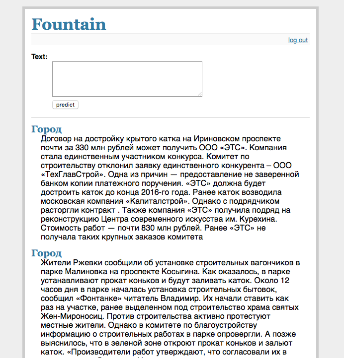

# Web view for Exercise 6. Search engine of news.
To run this You need to: 
1. download [Elasticsearch](https://www.elastic.co/downloads/elasticsearch) 
2. run `bin\elasticsearch` 
3. execute [notebook](../../Excercises_6.ipynb) 
4. export FLASK_APP=flaskr 
5. flask run 
   Then you can proceed to http://localhost:5000/ 
6. Enter **login: admin**, **password: default** 

### Additional data
You need to download [texts](https://yadi.sk/d/92TbmE7cy5Lds) and put it in `data\` folder. This is due to the reason that github does not allow to load files larger than 100mb.  

In the end, you should get something like this: 

Thanks to flask for [flaskr example](https://github.com/pallets/flask/tree/master/examples/flaskr/)
